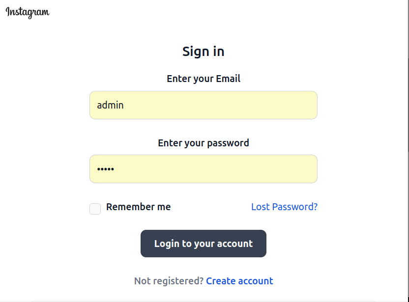
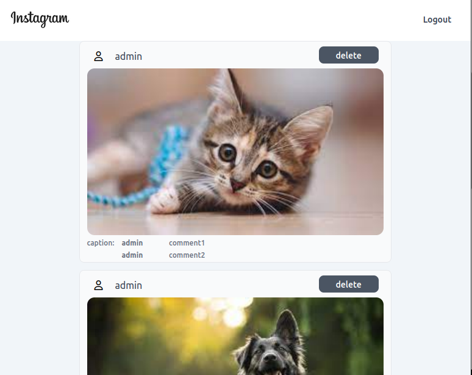
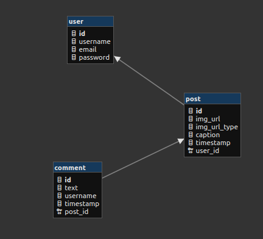
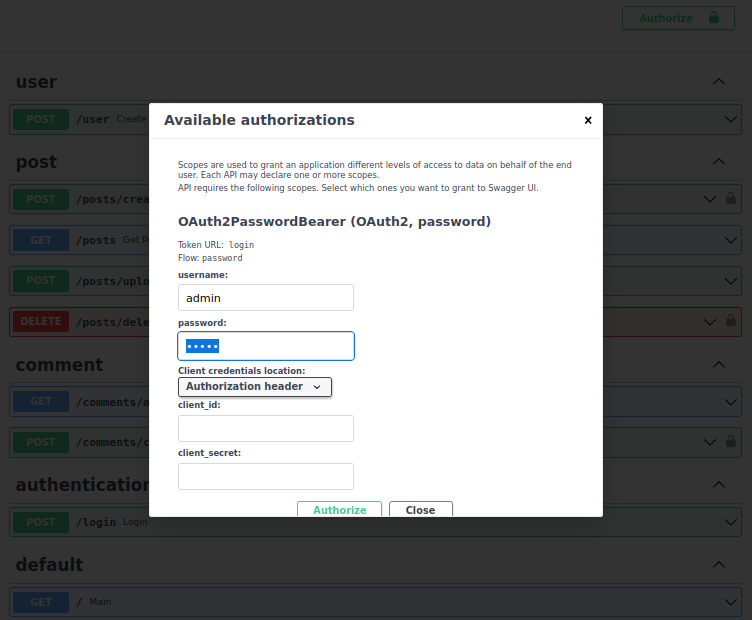
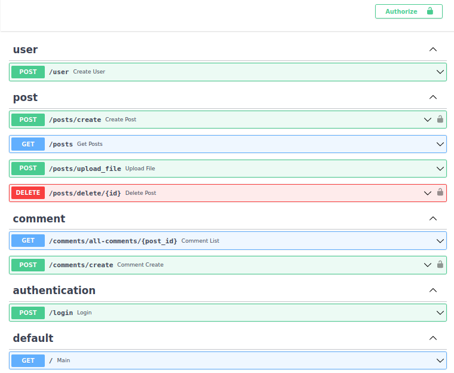

<p align="center">
  
  
</p>

# Instagrami

Backend FastAPI & React UI

This is an Instagram like simple project intended to work with any UI JS framework, here UI lib used is React.js.

---

#### Database

SQLITE is used, but any other database can be used instead in case of production.

##### Database Schema:

<p align="center">
  
</p>

---
##### Authentication OAuth2 is used :

<p align="center">
  
</p>

---
##### Endpoints :

<p align="center">
  
</p>

---

#### Start

* Clone the repo:  ***git clone*** **<https://github.com/Ahmed-Abdelgawad-Dev/Instagrami.git>**

###### FastAPI

* Use a virtual environment that you prefere.Could be pipenv | venv | conda. in Instagrami main folder.
* activate your choice virtual environment, in my case (Unix):

```shell
source ./venv/bin/activate
```

* Go to src folder
* Install the required packages

```shell
pip install -r requirements.txt
```

* Run the server

```shell
uvicorn main:app --reload
```

---

###### React

* Go to the ui folder:
* Install node_modules:

```shell
npm install || yarn
```

* Run the server:

```shell
npm ru start
